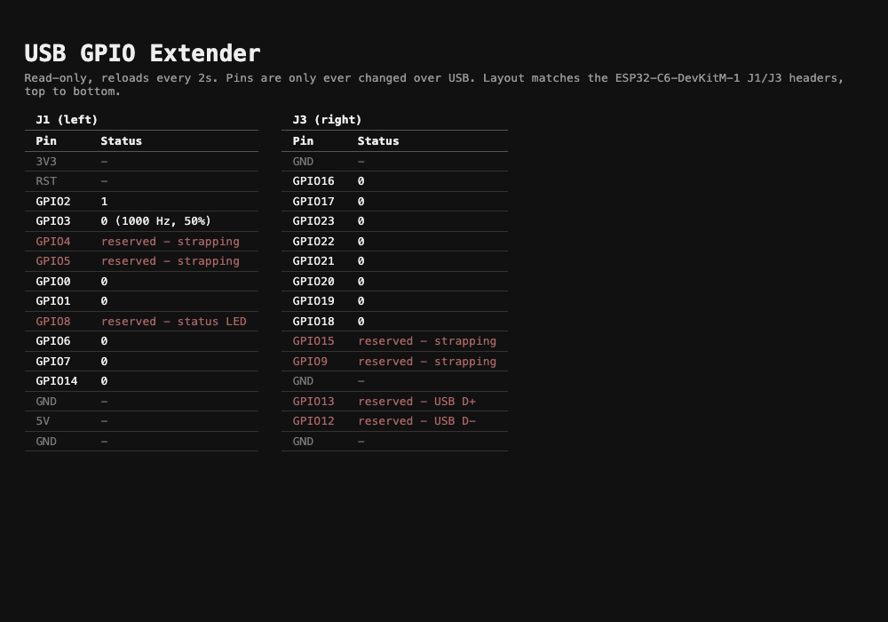
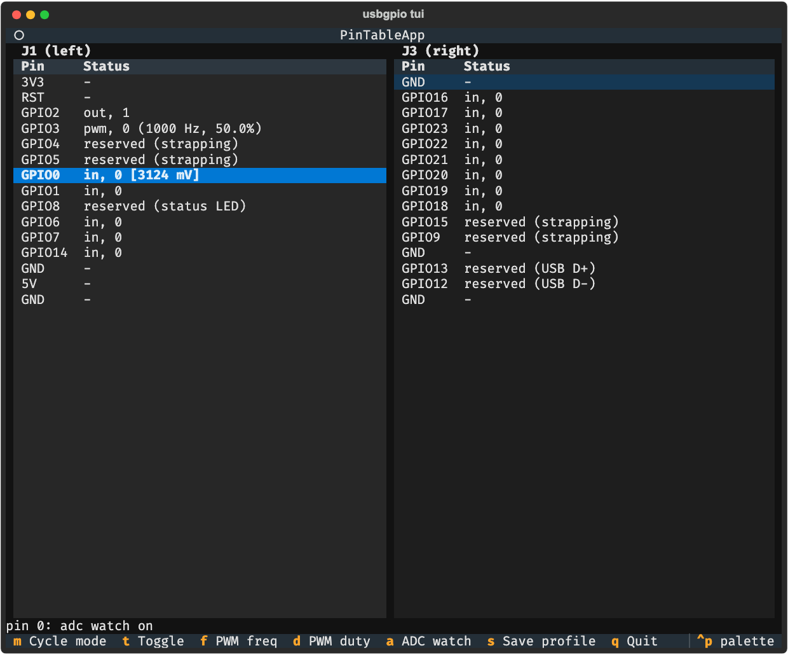

# USB GPIO Extender

Extend the GPIO pins of an ESP32-C6 board to your computer over a plain USB
cable. Plug the board in, and its pins behave like local pins from your
host: set a pin's mode, drive it high/low, read it back, run PWM, or read
an analog voltage — all from a Python library, a one-shot CLI command, or
an interactive terminal UI.

Works on macOS today; Linux is supported by the same host code (see
[Linux notes](#linux-notes)).

## How it talks to the board

The ESP32-C6 has a built-in USB Serial/JTAG peripheral — no extra USB
chip, no custom driver. It shows up as a plain serial port:
`/dev/cu.usbmodem*` on macOS, `/dev/ttyACM*` on Linux. The host and
firmware exchange short ASCII command/reply lines over that port (see
[`docs/protocol.md`](docs/protocol.md) if you want the wire format —
useful if you want to talk to the board from something other than Python,
e.g. `screen /dev/cu.usbmodem101 115200`).

## Hardware setup

### Which pins you can use

The firmware exposes GPIO0-GPIO30, minus a handful that are reserved and
will always reject `MODE`/`WRITE`/`PWM` with `ERR 2 pin reserved`:

| Reserved pins              | Why                                                |
|------------------------------|-----------------------------------------------------|
| GPIO12, GPIO13               | USB Serial/JTAG — this is the link to your computer |
| GPIO4, GPIO5, GPIO8, GPIO9, GPIO15 | Strapping pins (sampled at boot)             |
| GPIO24-GPIO30                | Embedded SPI flash (on-chip/in-package)             |

The flash-pin range assumes a chip/module with embedded flash (true for
the ESP32-C6-WROOM-1 and ESP32-C6-MINI-1 modules, and for bare
ESP32-C6FH-series chips). If you're on a board with external flash wiring
instead, double-check against its datasheet before assuming GPIO24-30 are
safe to reconfigure — this firmware reserves them defensively but hasn't
been verified against every possible board variant.

Separately, **GPIO8 is used directly by the onboard status LED** (see
[WiFi status page](#optional-wifi-status-page)) on the ESP32-C6-DevKitM-1
this project was developed against. It's already in the reserved table
above as a strapping pin, so `MODE`/`WRITE` never touch it anyway — but
if you're on different hardware, the LED driver may be pointed at the
wrong pin (`firmware/main/led_status.h`, `LED_STATUS_GPIO`); it fails
safely (logs and continues without a working LED) rather than damaging
anything, but won't visually confirm a WiFi connection either.

**Note on board naming:** this is the ESP32-C6-DevKitM-1 (ESP32-C6-MINI-1
module) - easy to confuse with the similarly-named ESP32-C6-DevKitC-1
(ESP32-C6-WROOM-1 module), which exposes a different pin set (e.g.
GPIO10/GPIO11 instead of GPIO14). The status page's header layout
(below) is specific to DevKitM-1; if you're on DevKitC-1 or something
else, `firmware/main/http_status.c`'s `J1_LEFT`/`J3_RIGHT` tables are the
only thing that needs updating to match.

Only GPIO0-GPIO6 have an ADC1 channel, so `ADC` only works on those.

### Wiring warnings

- **3.3V logic only.** ESP32-C6 GPIOs are not 5V tolerant. Connecting a
  5V signal to a pin can damage the chip — use a level shifter (or a
  resistor divider for simple digital signals) when talking to 5V
  peripherals.
- **Respect the per-pin current limit.** Like other ESP32-family chips,
  each GPIO has a maximum source/sink current documented in Espressif's
  ESP32-C6 datasheet (on the order of tens of mA per pin — check the
  datasheet for your exact chip/module before relying on a number here).
  Don't drive relays, motors, or other high-current loads directly from a
  pin; switch them through a transistor, MOSFET, or driver IC instead.
- **`out_od` (open-drain) pins read back `0` when "released" unless
  something pulls them up** — either an external resistor or (if you set
  the pin to `in_pu` first) the chip's internal pull-up. This is normal
  open-drain behavior, not a bug.

### Flashing the firmware

Requires [ESP-IDF](https://docs.espressif.com/projects/esp-idf/en/latest/esp32c6/get-started/)
(this project was built/tested against IDF v6.0).

```bash
cd firmware
idf.py set-target esp32c6
idf.py build
idf.py -p /dev/cu.usbmodem101 flash monitor
```

(swap in your board's actual port — see [Linux notes](#linux-notes) if
you're not sure how to find it on Linux). `monitor` is optional; it just
lets you watch the board's own output. Exit it with `Ctrl+]`.

### Optional: WiFi status page

The board can join your WiFi network to serve a small **read-only**
status page — it never becomes a second way to control pins; USB serial
remains the only control path, WiFi failures never affect it, and it's
entirely off by default.

To enable it, run this **before** `idf.py build`:

```bash
idf.py menuconfig
```

Go to **"USB GPIO Extender"** and set your WiFi SSID and password, then
save and exit. Build and flash as usual. Once connected:

- The onboard status LED turns solid blue.
- The board is reachable at **`esp32.local`** (mDNS; configurable in the
  same menu) and serves a live pin-status page at `http://esp32.local/`.
  The board pushes fresh pin state every 2 seconds over server-sent
  events (SSE), so the page updates in place without reloading; a small
  indicator in the header shows the connection state (live /
  reconnecting).



*Genuine live screenshot — fetched from `http://esp32.local/` over WiFi,
with GPIO2/GPIO3 set moments earlier over USB.*

Leaving the SSID blank (the default) disables WiFi entirely — the
firmware is a plain USB GPIO extender either way.

**Do not commit your real SSID/password.** They're stored in
`firmware/sdkconfig`, which is gitignored specifically because of this —
see `CLAUDE.md`'s Public Repo Rules if you're touching that file.

## Installing the host package

Requires Python 3.10+.

```bash
cd host
python -m venv .venv && source .venv/bin/activate
pip install -e ".[dev]"
```

This installs the `usbgpio` command and the `usbgpio` Python package.

### Verifying it works

```bash
usbgpio version
```

Auto-detects the board by USB vendor ID (Espressif, `0x303A`) and prints
its firmware version. Pass `--port` if you have more than one matching
device plugged in, or auto-detect doesn't find it:

```bash
usbgpio --port /dev/cu.usbmodem101 version
```

## CLI examples

```bash
usbgpio mode 4 out          # configure GPIO4 as a push-pull output
usbgpio write 4 1            # drive it high
usbgpio read 4                # -> 1
usbgpio mode 3 in_pu         # GPIO3 as input with internal pull-up
usbgpio read 3
usbgpio readall               # every pin's level, as a hex bitmask
usbgpio pwm 5 1000 50        # 1kHz PWM on GPIO5, 50% duty
usbgpio pwmstop 5
usbgpio adc 2                # -> "<raw 0-4095> <millivolts>"
usbgpio reset                 # back to input/no-pull on every pin, PWM off
usbgpio apply-profile relay-tester   # see Profiles, below
```

Every one-shot command accepts `--port` and `--baudrate` (baud rate is
ignored by USB CDC; it's accepted only for symmetry with other serial
tools). Full list: `usbgpio --help`.

### Using it as a library

```python
from usbgpio import Board

with Board.open() as board:      # auto-detects the port
    board.mode(4, "out")
    board.write(4, True)
    print(board.read(4))
```

## TUI

```bash
usbgpio tui [--profile <name>]
```

An interactive terminal UI (built with [Textual](https://textual.textualize.io/))
for configuring the board without writing code. On start (unless
`--profile` is given) it asks which saved profile to apply, or "blank" for
none.

Main view mirrors the [WiFi status page](#optional-wifi-status-page)'s
layout: two columns matching the board's physical J1 (left) / J3 (right)
headers, top to bottom, including power/ground pins in their real
position. Each pin's row shows its mode, current state, PWM freq/duty,
and (for pins you've turned on ADC watch for) the live millivolt reading;
reserved pins (strapping/USB/flash) are shown but never actionable. Data
refreshes about twice a second. `Tab`/`Shift+Tab` moves focus between the
two columns.



*Genuine screenshot — driven headlessly (Textual's own test/screenshot
tooling) against this board over USB: GPIO2 set to `out` and driven high,
GPIO3 running PWM, GPIO0 under live ADC watch, GPIO8 selected showing its
reserved/LED status.*

| Key | Action                                              |
|-----|-------------------------------------------------------|
| ↑/↓ | Move the selected-pin cursor                          |
| `m` | Cycle the selected pin's mode (in → in_pu → in_pd → out → out_od → ...) |
| `t` | Toggle an output pin high/low                         |
| `f` | Edit the selected pin's PWM frequency (starts PWM if not running) |
| `d` | Edit the selected pin's PWM duty cycle                |
| `a` | Toggle live ADC watch on the selected pin              |
| `s` | Save the current setup as a named profile              |
| `q` | Quit                                                   |

The TUI only calls the same `Board` API the CLI and library use — it has
no protocol logic of its own.

## Profiles

A profile is a named pin configuration: which pins are in which mode,
their initial state/PWM settings. Stored as TOML at
`~/.config/usbgpio/profiles/<name>.toml` (respects `$XDG_CONFIG_HOME` if
set — same path convention on macOS and Linux).

```toml
# ~/.config/usbgpio/profiles/relay-tester.toml
name = "relay-tester"

[pins.4]
mode = "out"
state = 0

[pins.5]
mode = "pwm"
freq = 1000
duty = 50

[pins.3]
mode = "in_pu"
```

- `mode` is one of `in`, `in_pu`, `in_pd`, `out`, `out_od`, or `pwm`.
- `state` (0 or 1) is only used for `out`/`out_od` pins, applied after the
  mode.
- `freq` (Hz) and `duty` (0-100) are only used for `mode = "pwm"`.
- Pins not listed are left however the firmware currently has them (a
  profile doesn't imply the others are reset — call `usbgpio reset` first
  if you want a clean slate).

Apply a saved profile without the TUI, e.g. from a boot script:

```bash
usbgpio apply-profile relay-tester
```

Save the TUI's current on-screen setup as a new profile with the `s` key
while it's running.

## Linux notes

- The board shows up as `/dev/ttyACM*` rather than `/dev/cu.usbmodem*`.
  `usbgpio`'s auto-detect (by USB VID `0x303A`) works the same way on
  both.
- You'll typically need permission to open the serial device. Either add
  your user to the `dialout` group (`sudo usermod -aG dialout $USER`, then
  log out and back in), or install a udev rule granting access — this
  project doesn't ship one, since the right group/rule name varies by
  distro.

## Development

```bash
cd host
pytest                 # host tests run without hardware (mocked serial)
ruff check . && ruff format --check .
```

A hardware smoke test suite lives at `host/tests/hw/` and is skipped
unless `USBGPIO_HW_TEST=1` is set (optionally with `USBGPIO_TEST_PORT` if
auto-detect won't find your board):

```bash
USBGPIO_HW_TEST=1 USBGPIO_TEST_PORT=/dev/cu.usbmodem101 pytest tests/hw
```

See [`CLAUDE.md`](CLAUDE.md) for architecture notes and conventions, and
[`docs/protocol.md`](docs/protocol.md) for the wire protocol.

## License

MIT — see [`LICENSE`](LICENSE).
